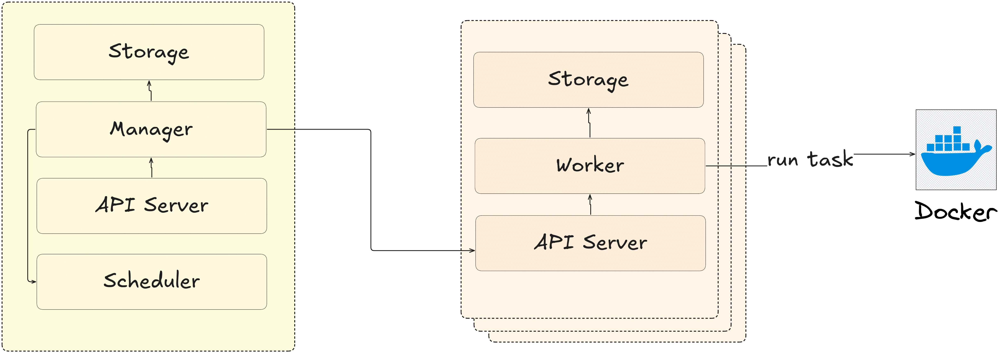

## Matrose

> "What I cannot create, I do not understand." - Richard Feynman

Introducing Matrose, an attempt to understand concepts underpinning orchestration systems.
Like most orchestrators Matrose uses a modular approach for layering separating concerns across the control plane and execution nodes.

## Architecture

- **Manager:** Uses a single manager, a manager is responsible dispatching tasks to workers. Tasks are dispatched using 1 of two algorithms; Round Robin and EPVM. Scheduler keeps track of tasks, their states and tracks worker machines. Tasks are dispatched to the manager through it's API.

- **Worker:** Workers are responsible for running tasks. The manager communicates with the worker through worker API. Workers provide relevant stats to the manange for scheduling purposes. Workers keep track of running task and attempt to restart failed stats

- **Task:** Task is the smallest unit of work in an orchestration system. For this application, tasks are ran as containers.
